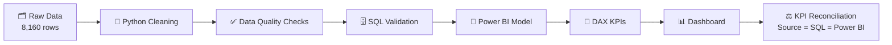
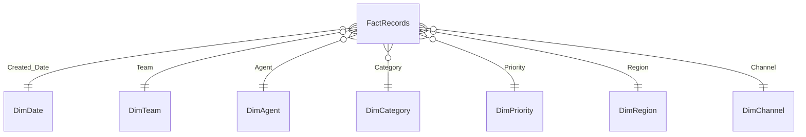

<div align="center">

# 📊 BI Validation & Monitoring

### From messy operational data to a reconciled, trustworthy Power BI dashboard


</div>

---

## 🎯 Project Goal

Prove that a dashboard's numbers can be **trusted**. This project takes intentionally dirty operational data through a full analytics workflow and **reconciles every KPI** across three layers: **Source (Python) ↔ SQL ↔ Power BI**.

> 💡 Every defect is *really present* in the raw CSV (not just flagged), so cleaning, SQL validation and DAX checks all have something real to catch.

---

## 🔄 Workflow



---

## 📦 Dataset

| 📄 File | 📏 Rows | 📝 Purpose |
|---|---:|---|
| `BI_Validation_Raw.csv` | 8,160 | Source extract with injected defects |
| `BI_Validation_Clean.csv` | 8,000 | Cleaned, one row per `Record_ID` |
| `BI_Validation_Data_Quality_Issues.csv` | 24 | Issue type, rule, action, count |
| `BI_Validation_Row_Issue_Log.csv` | 765 | Record-level issues for drilldown |
| `generate_bi_validation_data.py` | – | Reproduces everything (fixed seed) |

**📅 Period:** Jan – Sep 2026  |  **🌱 Seed:** `20260606`  |  **🔒 Privacy:** no real companies, people, emails or phones

### 🧱 Columns (25)
`Record_ID` · `Created_Date` · `Resolved_Date` · `Team` · `Region` · `Category` · `Priority` · `Channel` · `Complexity` · `Status` · `Agent` · `Root_Cause` · `Items_Processed` · `Resolution_Minutes` · `SLA_Target_Minutes` · `SLA_Status` · `QA_Score` · `QA_Result` · `Rework_Flag` · `CSAT` · `Repeat_Flag` · `Escalated_Flag` · `Created_Month` · `Week_Start` · `Data_Quality_Flag`

---

## 🐞 Injected Data-Quality Issues

| 🚨 Issue | 🔢 Rows | 🛠️ Cleaning Action |
|---|---:|---|
| 👯 Duplicate `Record_ID` | 160 | Keep first occurrence |
| ❓ Missing Category | 75 | Set to `Unknown` |
| 🚫 Invalid Category (`Unknown_Category`, `Misc`) | 10 | Set to `Unknown` |
| 👤 Missing Agent | 55 | Set to `Unassigned` |
| ⭐ Missing CSAT | 45 | Keep NULL (no imputation) |
| ➖ Negative Resolution_Minutes | 12 | Recalculate from dates |
| 💯 QA_Score above 100 | 10 | Set to NULL → `Not Scored` |
| ⏪ Resolved before Created | 12 | NULL date & minutes → `Unknown` SLA |
| 🔺 Invalid Priority (`P5`, `P0`) | 8 | Infer from original SLA target |
| ⏱️ Incorrect SLA_Status | 18 | Recalculate |
| 🧮 Missing/inconsistent derived fields | 15 more types | Recalculate |

> Full list with detection rules → `BI_Validation_Data_Quality_Issues.csv`

---

## ⚙️ Business Rules

| 🏷️ Priority | ⏳ SLA Target |
|---|---:|
| 🔴 P1 | 60 min |
| 🟠 P2 | 240 min |
| 🟡 P3 | 480 min |
| 🟢 P4 | 960 min |

- ✅ **SLA Met** if `Resolution_Minutes ≤ SLA_Target_Minutes`, otherwise 🔥 **Breached**; unresolved = ⏳ `Pending`
- 🏁 **Completion** = Status is `Completed` or `Closed`
- 🧪 **QA Pass** if `QA_Score ≥ 85`
- 🔁 **Rework** = `QA_Score < 80`, or (`Repeat_Flag = 1` and `QA_Score < 90`)
- 📆 `Week_Start` = Monday of the created week; `Created_Month` = `YYYY-MM`

---

## 🧹 Cleaning Rules (in order)

1. 🗑️ Drop duplicate `Record_ID`
2. 🏷️ Standardize Category → `Unknown`, Agent → `Unassigned`
3. ⭐ Leave missing CSAT as NULL
4. 💯 NULL QA scores outside 0–100
5. 🔺 Repair invalid Priority from SLA target
6. ⏪ NULL impossible `Resolved_Date`
7. ⏱️ Recalculate `Resolution_Minutes`, `SLA_Target_Minutes`, `SLA_Status`
8. 🧪 Recalculate `QA_Result`, `Rework_Flag`, `Created_Month`, `Week_Start`
9. 🚩 Set `Data_Quality_Flag`: **Nulled > Corrected > Standardized > Valid**

---

## 📈 Baseline KPIs (Clean Data)

| 📊 KPI | 🎯 Value |
|---|---:|
| ✅ Completion rate | **94.5%** |
| 🟢 SLA met | **86.0%** |
| 🔥 SLA breach | **14.0%** |
| ⏱️ Avg resolution | **328 min** |
| 😊 Avg CSAT | **4.05** |
| 🔁 Repeat rate | **6.2%** |
| 🚨 Escalation rate | **4.1%** |
| 🧪 QA pass rate | **87.8%** |
| 🛠️ Rework rate | **7.8%** |
| 🧼 Rows flagged Valid | **93.9%** |

---

## 🧩 Power BI Model



### 🖥️ Dashboard Pages
| # | 📄 Page | 🔍 Focus |
|---|---|---|
| 1 | 🏠 Executive Overview | Headline KPIs, monthly trend |
| 2 | ⚙️ Operational Performance | Team, region, priority, agent, workload |
| 3 | 🧼 Data Quality | Issue types, valid rate, raw vs clean |
| 4 | ⚖️ KPI Validation | Source vs SQL vs Power BI reconciliation |
| 5 | 🕵️ Investigation / Drilldown | Record-level issues & root causes |

### 📐 Sample DAX
```DAX
Total Records = COUNTROWS ( FactRecords )

SLA Achievement % =
DIVIDE (
    CALCULATE ( COUNTROWS ( FactRecords ), FactRecords[SLA_Status] = "Met" ),
    CALCULATE ( COUNTROWS ( FactRecords ), FactRecords[SLA_Status] IN { "Met", "Breached" } )
)

Avg CSAT = AVERAGE ( FactRecords[CSAT] )

Data Quality Rate =
DIVIDE (
    CALCULATE ( COUNTROWS ( FactRecords ), FactRecords[Data_Quality_Flag] = "Valid" ),
    COUNTROWS ( FactRecords )
)
```

### 🗄️ Sample SQL Reconciliation
```sql
SELECT
    COUNT(*)                                                AS total_records,
    ROUND(100.0 * SUM(CASE WHEN sla_status = 'Met' THEN 1 END)
          / NULLIF(SUM(CASE WHEN sla_status IN ('Met','Breached') THEN 1 END), 0), 1) AS sla_met_pct,
    ROUND(AVG(csat), 2)                                     AS avg_csat
FROM bi_validation_clean;
```

---

## 🚀 Getting Started

```bash
# 1️⃣ Regenerate all datasets (reproducible)
python generate_bi_validation_data.py ./data

# 2️⃣ Load BI_Validation_Clean.csv into SQL + Power BI
# 3️⃣ Build DimDate / DimTeam / DimAgent ... with DISTINCT
# 4️⃣ Compare KPIs: Python ↔ SQL ↔ Power BI
```

---

## 📁 Suggested Repo Structure

```
📦 bi-validation-monitoring
 ┣ 📂 data
 ┃ ┣ 📄 BI_Validation_Raw.csv
 ┃ ┣ 📄 BI_Validation_Clean.csv
 ┃ ┣ 📄 BI_Validation_Data_Quality_Issues.csv
 ┃ ┗ 📄 BI_Validation_Row_Issue_Log.csv
 ┣ 📂 python      🐍 cleaning & checks
 ┣ 📂 sql         🗄️ validation queries
 ┣ 📂 powerbi     📊 .pbix, DAX measures
 ┣ 📂 docs        📚 screenshots, notes
 ┣ 📄 generate_bi_validation_data.py
 ┗ 📄 README.md
```

---

<div align="center">

⭐ **Built to show that good analytics starts with trusted data** ⭐

</div>
